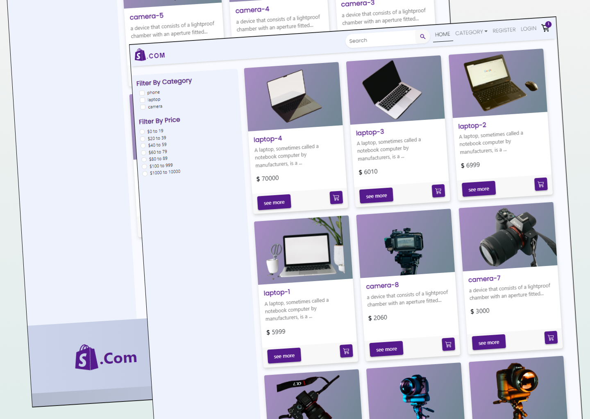

## site photo

# client site

To install yarn
### `yarn install`

To run client
### `yarn dev`

to build
### `yarn run build`

Runs the app in the development mode.\
Open [http://127.0.0.1:5173/](http://127.0.0.1:5173/) to view it in your browser.

render server link
https://shopping-dot-com-server.onrender.com

